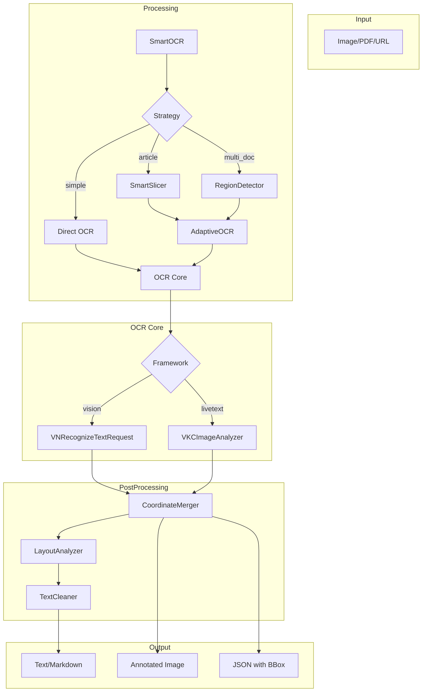
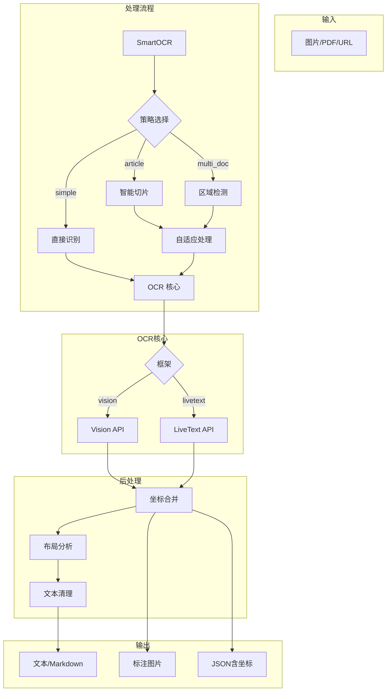

[](https://pepy.tech/project/ocrmac)
# ocrmac

A small Python wrapper to extract text from images on a Mac system. Uses the vision framework from Apple. Simply pass a path to an image or a `PIL` image directly and get lists of texts, their confidence, and bounding box.

> **Fork Notice**: This is an enhanced fork of [straussmaximilian/ocrmac](https://github.com/straussmaximilian/ocrmac). See [What's New in This Fork](#whats-new-in-this-fork) for improvements.

## What's New in This Fork

This fork adds significant enhancements for handling **long screenshots**, **complex documents**, and **Chinese text**:

| Feature | Original | This Fork |
|---------|----------|-----------|
| **Smart OCR** | - | Auto-selects best strategy for each image |
| **Long Screenshot Support** | Limited | Intelligent slicing at text boundaries |
| **Duplicate Handling** | - | Auto-removes overlapping content |
| **Text Cleaning** | - | Merges broken words, formats headers |
| **Chinese Support** | Basic | Enhanced (【标题】→ ## 标题, list formatting) |
| **Layout Analysis** | - | Preserves document structure |
| **CLI** | Basic | Full-featured with batch processing |
| **Module Architecture** | Monolithic | Modular (analysis, processing, postprocessing) |

### Quick Comparison

```python
# Original ocrmac - basic OCR
from ocrmac import OCR
text = OCR('image.png').recognize()

# This fork - smart OCR with auto-optimization
from ocrmac import smart_ocr
result = smart_ocr('long_screenshot.png')  # Handles 10000px+ images automatically
print(result['text'])      # Clean, deduplicated text
print(result['strategy'])  # 'article', 'multi_doc', or 'simple'
```

### Architecture | 架构



### Module Structure | 模块结构

```
ocrmac/
├── ocrmac.py           # Core OCR (Vision/LiveText API)
├── cli.py              # Command-line interface
├── processing/         # Processing pipeline
│   ├── smart.py        #   SmartOCR - strategy selection
│   ├── adaptive.py     #   AdaptiveOCR - slice & merge
│   └── slicer.py       #   SmartSlicer - safe boundary slicing
├── analysis/           # Analysis modules
│   ├── image.py        #   ImageAnalyzer - image profiling
│   ├── layout.py       #   LayoutAnalyzer - paragraph/heading detection
│   ├── region.py       #   RegionDetector - multi-region detection
│   ├── coordinates.py  #   CoordinateMerger - bbox merging
│   └── table.py        #   TableDetector - table structure
├── preprocessing/      # Image preprocessing
│   └── image.py        #   ImagePreprocessor - enhancement
└── postprocessing/     # Text postprocessing
    └── text.py         #   TextCleaner - dedup/merge/format
```

This only works on macOS systems with newer macOS versions (10.15+).

## Installation

```bash
pipx install git+https://github.com/ttieli/ocrmac.git
```

Or with pip:
```bash
pip install git+https://github.com/ttieli/ocrmac.git
```

## CLI Usage

After installation, you can use the `ocrmac` command directly in terminal:

```bash
# Basic usage - OCR an image and save to file (Default behavior)
ocrmac image.png

# Print output to terminal (Old default)
ocrmac image.png --stdout

# Save output to markdown file
ocrmac image.png -o result.md

# OCR a PDF file (all pages)
ocrmac document.pdf -o result.md

# OCR from URL
ocrmac https://example.com/image.png

# Batch process a directory
ocrmac ./images/ -o ./results/

# Parallel processing - multiple files/URLs at once (New in 1.4.0)
ocrmac a.png b.png c.png --stdout       # Parallel OCR, results separated
ocrmac "url1" "url2" "url3" --stdout    # Parallel download + OCR
cat urls.txt | ocrmac --batch --stdout  # Read inputs from stdin
ocrmac a.png b.png -w 4                 # Limit to 4 workers

# Use different output formats
ocrmac image.png -f text          # Plain text
ocrmac image.png -f json          # JSON with coordinates
ocrmac image.png -f json --details # JSON with bounding boxes

# Set language preference
ocrmac image.png -l zh-Hans       # Chinese (Simplified)
ocrmac image.png -l en-US         # English

# Choose OCR framework
ocrmac image.png --framework vision    # Apple Vision
ocrmac image.png --framework livetext  # Apple LiveText (default, macOS Sonoma+)
```

### CLI Options

| Option | Description |
|--------|-------------|
| `-o, --output` | Output file path. |
| `-p, --stdout` | Print output to stdout instead of saving to file. |
| `-f, --format` | Output format: `markdown` (default), `text`, `json` |
| `-l, --language` | Language preference (e.g., `zh-Hans`, `en-US`) |
| `--framework` | OCR framework: `vision` or `livetext` (default) |
| `--level` | Recognition level: `accurate` (default) or `fast` |
| `-r, --recursive` | Process directories recursively |
| `--no-metadata` | Exclude metadata from markdown output |
| `--details` | Include bounding box details in JSON output |
| `-b, --batch` | Read input paths from stdin (one per line) |
| `-w, --workers N` | Number of parallel workers (default: min(inputs, 8)) |

### Supported Input Types

- **Images**: PNG, JPG, JPEG, GIF, BMP, TIFF, WebP
- **PDF**: All pages converted to images and OCR'd
- **DOCX**: Text extracted + embedded images OCR'd
- **URL**: Remote images, PDFs, or DOCX files

## Python API

### Basic Usage

```python
from ocrmac import ocrmac
annotations = ocrmac.OCR('test.png').recognize()
print(annotations)
```

Output (Text, Confidence, BoundingBox):

```
[("GitHub: Let's build from here - X", 0.5, [0.16, 0.91, 0.17, 0.01]),
('github.com', 0.5, [0.174, 0.87, 0.06, 0.01]),
('Qi &0 O M #O', 0.30, [0.65, 0.87, 0.23, 0.02]),
[...]
('P&G U TELUS', 0.5, [0.64, 0.16, 0.22, 0.03])]
```
(BoundingBox precision capped for readability reasons)

### Create Annotated Images

Visualize OCR results by drawing bounding boxes and text labels on the original image.

#### Method 1: PIL (Recommended for saving files)

```python
from ocrmac import ocrmac

ocr = ocrmac.OCR('test.png')
ocr.recognize()

# Generate annotated image
annotated = ocr.annotate_PIL(color="red", fontsize=12)
annotated.save('output.png')
```

**Parameters:**
| Parameter | Type | Default | Description |
|-----------|------|---------|-------------|
| `color` | str | `"red"` | Box and text color |
| `fontsize` | int | `12` | Font size for labels |

**Returns:** `PIL.Image.Image` - Can be saved with `.save()` method

#### Method 2: Matplotlib (For Jupyter/interactive display)

```python
from ocrmac import ocrmac

ocr = ocrmac.OCR('test.png')
ocr.recognize()

# Display with matplotlib
fig = ocr.annotate_matplotlib(figsize=(20, 20), color="red", alpha=0.5, fontsize=12)
fig.savefig('output.png')  # Or use plt.show() in Jupyter
```

**Parameters:**
| Parameter | Type | Default | Description |
|-----------|------|---------|-------------|
| `figsize` | tuple | `(20, 20)` | Figure size in inches |
| `color` | str | `"red"` | Box and text color |
| `alpha` | float | `0.5` | Image transparency (0-1) |
| `fontsize` | int | `12` | Font size for labels |

**Returns:** `matplotlib.figure.Figure`

#### Comparison

| Feature | `annotate_PIL()` | `annotate_matplotlib()` |
|---------|------------------|-------------------------|
| Dependency | PIL (required) | matplotlib (optional) |
| Output | `Image.Image` | `Figure` |
| Transparency | ✗ | ✓ `alpha` param |
| Best for | File saving, batch | Jupyter, interactive |


### Coordinate Conversion Utilities

Convert Apple Vision normalized coordinates (0-1) to pixel coordinates:

```python
from ocrmac.ocrmac import convert_coordinates_pil, convert_coordinates_pyplot

# Vision returns: (x, y, w, h) where y=0 is at BOTTOM
bbox = [0.1, 0.8, 0.3, 0.05]  # normalized coordinates
image_width, image_height = 1000, 800

# For PIL/Pillow (returns x1, y1, x2, y2)
x1, y1, x2, y2 = convert_coordinates_pil(bbox, image_width, image_height)

# For Matplotlib (returns x1, y1, width, height in plot coords)
x1, y1, w, h = convert_coordinates_pyplot(bbox, image_width, image_height)
```

### Get Results with Pixel Coordinates

```python
from ocrmac import ocrmac

ocr = ocrmac.OCR('test.png')

# Get results with pixel coordinates directly
results = ocr.recognize(px=True)
# Returns: [(text, confidence, (x1, y1, x2, y2)), ...]
# Coordinates are in pixels, ready for drawing
```

## Advanced Features

### Smart OCR (New in 1.3.0)

Intelligent OCR with automatic strategy selection for optimal results on long screenshots and complex documents.

```python
from ocrmac import smart_ocr

# Simple usage - automatically selects best strategy
result = smart_ocr('long_screenshot.png')
print(result['text'])

# With verbose output to see strategy selection
result = smart_ocr('document.png', verbose=True)
print(f"Strategy: {result['strategy']}")  # 'article', 'multi_doc', or 'simple'
print(f"Quality score: {result['score']:.2f}")
```

**Features:**
- **Auto-slicing**: Intelligently splits long screenshots at safe boundaries (between text lines)
- **Duplicate removal**: Handles overlapping content from sliced regions
- **Layout analysis**: Preserves document structure (headings, paragraphs, lists)
- **Text cleaning**: Merges broken words, formats Chinese headers, normalizes lists

```python
from ocrmac import SmartOCR
from PIL import Image

# Advanced usage with SmartOCR class
ocr = SmartOCR(
    framework='livetext',
    quality_threshold=0.6,
    verbose=True
)

image = Image.open('document.png')
result = ocr.process(image)

print(result['text'])           # Cleaned text
print(result['strategy'])       # Strategy used
print(result['profile'])        # Image analysis profile
```

### Table Recovery

You can extract table structures from images using the `TableDetector`.

```python
from ocrmac import OCR
from ocrmac.table_recovery import TableDetector

# 1. Get OCR results
ocr = OCR('table_image.png', framework='livetext', unit='line')
results = ocr.recognize()

# 2. Detect table
detector = TableDetector()
table = detector.detect(results)

if table:
    print(table.to_markdown())
```

### Layout Analysis

Analyze document structure to identify paragraphs, headings, and lists.

```python
from ocrmac import OCR
from ocrmac.layout_analyzer import LayoutAnalyzer

# 1. Get OCR results
ocr = OCR('document_image.png', framework='livetext', unit='line')
results = ocr.recognize()

# 2. Analyze layout
analyzer = LayoutAnalyzer()
layout = analyzer.analyze(results)

# 3. Export to Markdown
print(analyzer.to_markdown(layout))
```

## API Reference

### Classes

#### `OCR` Class

Main class for OCR operations.

```python
from ocrmac import ocrmac

ocr = ocrmac.OCR(
    image,                      # str path or PIL.Image
    framework='vision',         # 'vision' or 'livetext'
    recognition_level='accurate',  # 'accurate' or 'fast' (vision only)
    language_preference=None,   # e.g. ['zh-Hans', 'en-US']
    confidence_threshold=0.0,   # 0.0-1.0 (vision only)
    detail=True,                # include bounding boxes
    unit='token'                # 'token' or 'line' (livetext only)
)

# Methods
results = ocr.recognize(px=False)  # px=True for pixel coordinates
annotated = ocr.annotate_PIL(color="red", fontsize=12)
fig = ocr.annotate_matplotlib(figsize=(20,20), color="red", alpha=0.5, fontsize=12)
```

### Helper Functions

```python
from ocrmac import ocrmac

# Direct function calls (without class)
results = ocrmac.text_from_image(
    image,                      # str path or PIL.Image
    recognition_level='accurate',
    language_preference=None,
    confidence_threshold=0.0,
    detail=True
)

results = ocrmac.livetext_from_image(
    image,                      # str path or PIL.Image
    language_preference=None,
    detail=True,
    unit='token'                # 'token' or 'line'
)

# Coordinate conversion
x1, y1, x2, y2 = ocrmac.convert_coordinates_pil(bbox, width, height)
x1, y1, w, h = ocrmac.convert_coordinates_pyplot(bbox, width, height)
```

### Functionality Summary

- You can pass the path to an image or a PIL image as an object
- You can use as a class (`ocrmac.OCR`) or function (`ocrmac.text_from_image`)
- You can pass several arguments:
    - `recognition_level`: `fast` or `accurate`
    - `language_preference`: A list with languages for post-processing, e.g. `['en-US', 'zh-Hans', 'de-DE']`.
- You can get an annotated output either as PIL image (`annotate_PIL`) or matplotlib figure (`annotate_matplotlib`)
- You can either use the `vision` or the `livetext` framework as backend.

#### Example: Select Language Preference

You can set a language preference like so:

```python
ocrmac.OCR('test.png',language_preference=['en-US'])
```

What abbreviation should you use for your language of choice? [Here](https://www.iana.org/assignments/language-subtag-registry/language-subtag-registry) is an overview of language codes, e.g.: `Chinese (Simplified)` -> `zh-Hans`, `English` -> `en-US` ..

If you set a wrong language you will see an error message showing the languages available. Note that the `recognition_level` will affect the languages available (fast has fewer)

See also this [Example Notebook](https://github.com/ttieli/ocrmac/blob/main/notebooks/ExampleNotebook.ipynb) for implementation details.


## Speed

Timings for the  above recognize-statement:
MacBook Pro (Apple M3 Max):
- `accurate`: 207 ms ± 1.49 ms per loop (mean ± std. dev. of 7 runs, 1 loop each)
- `fast`: 131 ms ± 702 µs per loop (mean ± std. dev. of 7 runs, 10 loops each)
- `livetext`: 174 ms ± 4.12 ms per loop (mean ± std. dev. of 7 runs, 1 loop each)


## About LiveText
Since MacOS Sonoma, `LiveText` is now supported, which is stronger than the `VisionKit` OCR. You can try this feature by:
```python
# Use the OCR class
from ocrmac import ocrmac
annotations = ocrmac.OCR('test.png', framework="livetext").recognize()
print(annotations)

# Or use the helper directly
annotations = ocrmac.livetext_from_image('test.png')
```
Notice, when using this feature, the `recognition_level` and `confidence_threshold` are not available. The `confidence` output will always be 1. Additionally, LiveText supports an optional `unit` parameter for flat output: use `unit='line'` to return full-line items (instead of token-level).

## Technical Background & Motivation
If you want to do Optical character recognition (OCR) with Python, widely used tools are [`pytesseract`](https://github.com/madmaze/pytesseract) or [`EasyOCR`](https://github.com/JaidedAI/EasyOCR). For me, tesseract never did give great results. EasyOCR did, but it is slow on CPU. While there is GPU acceleration with CUDA, this does not work for Mac. *(Update from 9/2023: Apparently EasyOCR now has mps support for Mac.)*
In any case, as a Mac user you might notice that you can, with newer versions, directly copy and paste from images. The built-in OCR functionality is quite good. The underlying functionality for this is [`VNRecognizeTextRequest`](https://developer.apple.com/documentation/vision/vnrecognizetextrequest) from Apple's Vision Framework. Unfortunately it is in Swift; luckily, a wrapper for this exists. [`pyobjc-framework-Vision`](https://github.com/ronaldoussoren/pyobjc). `ocrmac` utilizes this wrapper and provides an easy interface to use this for OCR.

I found the following resources very helpful when implementing this:
- [Gist from RheTbull](https://gist.github.com/RhetTbull/1c34fc07c95733642cffcd1ac587fc4c)
- [Apple Documentation](https://developer.apple.com/documentation/vision/recognizing_text_in_images/)
- [Using Pythonista with VNRecognizeTextRequest](https://forum.omz-software.com/topic/6016/recognize-text-from-picture)

I also did a small writeup about OCR on mac in this blogpost on [medium.com](https://betterprogramming.pub/a-practical-guide-to-extract-text-from-images-ocr-in-python-d8c9c30ae74b).

## Contributing

If you have a feature request or a bug report, please post it either as an idea in the discussions or as an issue on the GitHub issue tracker.  If you want to contribute, put a PR for it. Thanks!

If you like the project, consider starring it!

---

# ocrmac 中文文档

一个轻量级的 Python 工具，用于在 Mac 系统上从图片中提取文字。使用 Apple 的 Vision 框架，只需传入图片路径或 PIL 图像对象，即可获取文字内容、置信度和边界框信息。

> **Fork 说明**：这是 [straussmaximilian/ocrmac](https://github.com/straussmaximilian/ocrmac) 的增强分支。

## 本 Fork 的改进

针对**长截图**、**复杂文档**和**中文文本**进行了大量优化：

| 功能 | 原版 | 本 Fork |
|------|------|---------|
| **智能 OCR** | 无 | 自动选择最佳识别策略 |
| **长截图支持** | 有限 | 在文字边界智能切片 |
| **重复处理** | 无 | 自动去除重叠内容 |
| **文本清理** | 无 | 合并断词、格式化标题 |
| **中文支持** | 基础 | 增强（【标题】→ ## 标题，列表格式化） |
| **布局分析** | 无 | 保持文档结构 |
| **命令行** | 基础 | 完整功能，支持批量处理 |
| **模块架构** | 单体 | 模块化（分析、处理、后处理） |

### 快速对比

```python
# 原版 - 基础 OCR
from ocrmac import OCR
text = OCR('image.png').recognize()

# 本 Fork - 智能 OCR，自动优化
from ocrmac import smart_ocr
result = smart_ocr('long_screenshot.png')  # 自动处理 10000px+ 长图
print(result['text'])      # 清理后的文本，已去重
print(result['strategy'])  # 'article', 'multi_doc', 或 'simple'
```

### 架构图



### 模块结构

```
ocrmac/
├── ocrmac.py           # 核心 OCR（Vision/LiveText）
├── cli.py              # 命令行接口
├── processing/         # 处理管道
│   ├── smart.py        #   SmartOCR - 策略选择
│   ├── adaptive.py     #   AdaptiveOCR - 切片合并
│   └── slicer.py       #   SmartSlicer - 安全切片
├── analysis/           # 分析模块
│   ├── image.py        #   ImageAnalyzer - 图像分析
│   ├── layout.py       #   LayoutAnalyzer - 布局检测
│   ├── region.py       #   RegionDetector - 区域检测
│   ├── coordinates.py  #   CoordinateMerger - 坐标合并
│   └── table.py        #   TableDetector - 表格检测
├── preprocessing/      # 预处理
│   └── image.py        #   ImagePreprocessor - 图像增强
└── postprocessing/     # 后处理
    └── text.py         #   TextCleaner - 去重/格式化
```

仅支持 macOS 10.15+ 系统。

## 安装

```bash
pipx install git+https://github.com/ttieli/ocrmac.git
```

或使用 pip：
```bash
pip install git+https://github.com/ttieli/ocrmac.git
```

## 命令行使用

安装后，可直接在终端使用 `ocrmac` 命令：

```bash
# 基本用法 - 识别图片并自动保存（默认行为）
ocrmac image.png

# 打印到终端（不保存文件）
ocrmac image.png --stdout

# 保存为指定文件
ocrmac image.png -o result.md

# 识别 PDF 文件（所有页面）
ocrmac document.pdf -o result.md

# 识别网络图片
ocrmac https://example.com/image.png

# 批量处理目录
ocrmac ./images/ -o ./results/

# 并行处理 - 多文件/多 URL 同时识别（1.4.0 新增）
ocrmac a.png b.png c.png --stdout       # 并行 OCR，分隔符输出
ocrmac "url1" "url2" "url3" --stdout    # 并行下载+OCR
cat urls.txt | ocrmac --batch --stdout  # 从 stdin 读取输入
ocrmac a.png b.png -w 4                 # 限制 4 个并行线程

# 不同输出格式
ocrmac image.png -f text          # 纯文本
ocrmac image.png -f json          # JSON 格式
ocrmac image.png -f json --details # JSON 含坐标信息

# 设置语言偏好
ocrmac image.png -l zh-Hans       # 简体中文
ocrmac image.png -l en-US         # 英文

# 选择 OCR 框架
ocrmac image.png --framework vision    # Apple Vision
ocrmac image.png --framework livetext  # Apple LiveText（默认，需 macOS Sonoma+）
```

### 命令行选项

| 选项 | 说明 |
|------|------|
| `-o, --output` | 输出文件路径 |
| `-p, --stdout` | 打印到终端，不保存文件 |
| `-f, --format` | 输出格式：`markdown`（默认）、`text`、`json` |
| `-l, --language` | 语言偏好（如 `zh-Hans`、`en-US`） |
| `--framework` | OCR 框架：`vision` 或 `livetext`（默认） |
| `--level` | 识别级别：`accurate`（默认）或 `fast` |
| `-r, --recursive` | 递归处理目录 |
| `--no-metadata` | 不在 Markdown 中包含元数据 |
| `--details` | 在 JSON 中包含边界框详情 |
| `-b, --batch` | 从 stdin 读取输入路径（每行一个） |
| `-w, --workers N` | 并行线程数（默认：min(输入数, 8)） |

### 支持的输入类型

- **图片**：PNG、JPG、JPEG、GIF、BMP、TIFF、WebP
- **PDF**：所有页面转为图片后进行 OCR
- **DOCX**：提取文本 + 对嵌入图片进行 OCR
- **URL**：远程图片、PDF 或 DOCX 文件

## Python API 使用

### 基本用法

```python
from ocrmac import ocrmac
annotations = ocrmac.OCR('test.png').recognize()
print(annotations)
```

输出格式（文字, 置信度, 边界框）：

```
[("GitHub: Let's build from here - X", 0.5, [0.16, 0.91, 0.17, 0.01]),
('github.com', 0.5, [0.174, 0.87, 0.06, 0.01]),
...]
```

### 创建标注图片

在原图上绘制识别框和文字标签，可视化 OCR 结果。

#### 方式一：PIL（推荐用于保存文件）

```python
from ocrmac import ocrmac

ocr = ocrmac.OCR('test.png')
ocr.recognize()

# 生成标注图片
annotated = ocr.annotate_PIL(color="red", fontsize=12)
annotated.save('output.png')
```

**参数：**
| 参数 | 类型 | 默认值 | 说明 |
|------|------|--------|------|
| `color` | str | `"red"` | 框和文字颜色 |
| `fontsize` | int | `12` | 字体大小 |

**返回：** `PIL.Image.Image` - 可用 `.save()` 保存

#### 方式二：Matplotlib（用于 Jupyter/交互显示）

```python
from ocrmac import ocrmac

ocr = ocrmac.OCR('test.png')
ocr.recognize()

# 使用 matplotlib 显示
fig = ocr.annotate_matplotlib(figsize=(20, 20), color="red", alpha=0.5, fontsize=12)
fig.savefig('output.png')  # 或在 Jupyter 中用 plt.show()
```

**参数：**
| 参数 | 类型 | 默认值 | 说明 |
|------|------|--------|------|
| `figsize` | tuple | `(20, 20)` | 图片尺寸（英寸） |
| `color` | str | `"red"` | 框和文字颜色 |
| `alpha` | float | `0.5` | 图片透明度 (0-1) |
| `fontsize` | int | `12` | 字体大小 |

**返回：** `matplotlib.figure.Figure`

#### 对比

| 特性 | `annotate_PIL()` | `annotate_matplotlib()` |
|------|------------------|-------------------------|
| 依赖 | PIL（必装） | matplotlib（可选） |
| 输出 | `Image.Image` | `Figure` |
| 透明度 | ✗ | ✓ `alpha` 参数 |
| 适用 | 保存文件、批处理 | Jupyter、交互式 |

### 坐标转换工具

将 Apple Vision 归一化坐标 (0-1) 转为像素坐标：

```python
from ocrmac.ocrmac import convert_coordinates_pil, convert_coordinates_pyplot

# Vision 返回: (x, y, w, h)，y=0 在图片底部
bbox = [0.1, 0.8, 0.3, 0.05]  # 归一化坐标
image_width, image_height = 1000, 800

# PIL/Pillow 格式（返回 x1, y1, x2, y2）
x1, y1, x2, y2 = convert_coordinates_pil(bbox, image_width, image_height)

# Matplotlib 格式（返回绘图坐标）
x1, y1, w, h = convert_coordinates_pyplot(bbox, image_width, image_height)
```

### 获取像素坐标结果

```python
from ocrmac import ocrmac

ocr = ocrmac.OCR('test.png')

# 直接获取像素坐标
results = ocr.recognize(px=True)
# 返回: [(text, confidence, (x1, y1, x2, y2)), ...]
# 坐标已转为像素值，可直接用于绘图
```

## API 参考

### 类

#### `OCR` 类

OCR 操作的主类。

```python
from ocrmac import ocrmac

ocr = ocrmac.OCR(
    image,                      # 路径字符串或 PIL.Image
    framework='vision',         # 'vision' 或 'livetext'
    recognition_level='accurate',  # 'accurate' 或 'fast'（仅 vision）
    language_preference=None,   # 如 ['zh-Hans', 'en-US']
    confidence_threshold=0.0,   # 0.0-1.0（仅 vision）
    detail=True,                # 是否包含边界框
    unit='token'                # 'token' 或 'line'（仅 livetext）
)

# 方法
results = ocr.recognize(px=False)  # px=True 返回像素坐标
annotated = ocr.annotate_PIL(color="red", fontsize=12)
fig = ocr.annotate_matplotlib(figsize=(20,20), color="red", alpha=0.5, fontsize=12)
```

### 辅助函数

```python
from ocrmac import ocrmac

# 直接函数调用（无需实例化类）
results = ocrmac.text_from_image(
    image,                      # 路径字符串或 PIL.Image
    recognition_level='accurate',
    language_preference=None,
    confidence_threshold=0.0,
    detail=True
)

results = ocrmac.livetext_from_image(
    image,                      # 路径字符串或 PIL.Image
    language_preference=None,
    detail=True,
    unit='token'                # 'token' 或 'line'
)

# 坐标转换
x1, y1, x2, y2 = ocrmac.convert_coordinates_pil(bbox, width, height)
x1, y1, w, h = ocrmac.convert_coordinates_pyplot(bbox, width, height)
```

### 功能特性

- 支持传入图片路径或 PIL 图像对象
- 可使用类 (`ocrmac.OCR`) 或函数 (`ocrmac.text_from_image`)
- 支持多种参数：
    - `recognition_level`：`fast` 或 `accurate`
    - `language_preference`：语言偏好列表，如 `['zh-Hans', 'en-US']`
- 可生成标注图片（PIL 或 matplotlib）
- 支持 `vision` 和 `livetext` 两种后端框架

### 设置语言偏好

```python
ocrmac.OCR('test.png', language_preference=['zh-Hans'])
```

语言代码参考：`简体中文` -> `zh-Hans`，`英文` -> `en-US`

## 高级功能

### 智能 OCR（1.3.0 新增）

自动选择最佳策略，优化长截图和复杂文档的识别效果。

```python
from ocrmac import smart_ocr

# 简单用法 - 自动选择最佳策略
result = smart_ocr('long_screenshot.png')
print(result['text'])

# 详细输出
result = smart_ocr('document.png', verbose=True)
print(f"策略: {result['strategy']}")  # 'article', 'multi_doc', 'simple'
print(f"质量评分: {result['score']:.2f}")
```

**功能特点：**
- **智能切片**：在安全边界（文字行之间）自动分割长截图
- **去重处理**：处理切片重叠区域的重复内容
- **布局分析**：保持文档结构（标题、段落、列表）
- **文本清理**：合并断词、格式化中文标题、规范化列表

## 关于 LiveText

macOS Sonoma 起支持 LiveText，识别效果优于 VisionKit：

```python
from ocrmac import ocrmac
annotations = ocrmac.OCR('test.png', framework="livetext").recognize()
```

注意：使用 LiveText 时，`recognition_level` 和 `confidence_threshold` 不可用，置信度始终为 1。

## 贡献

欢迎提交 Issue 或 Pull Request！
